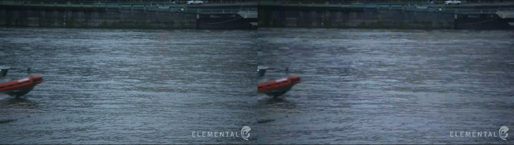
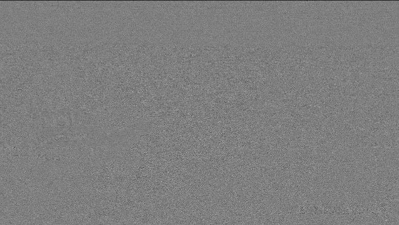
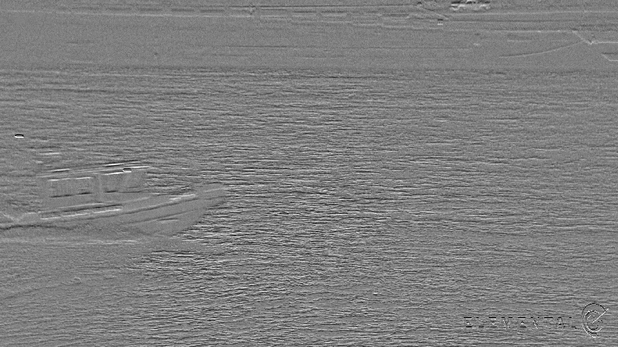
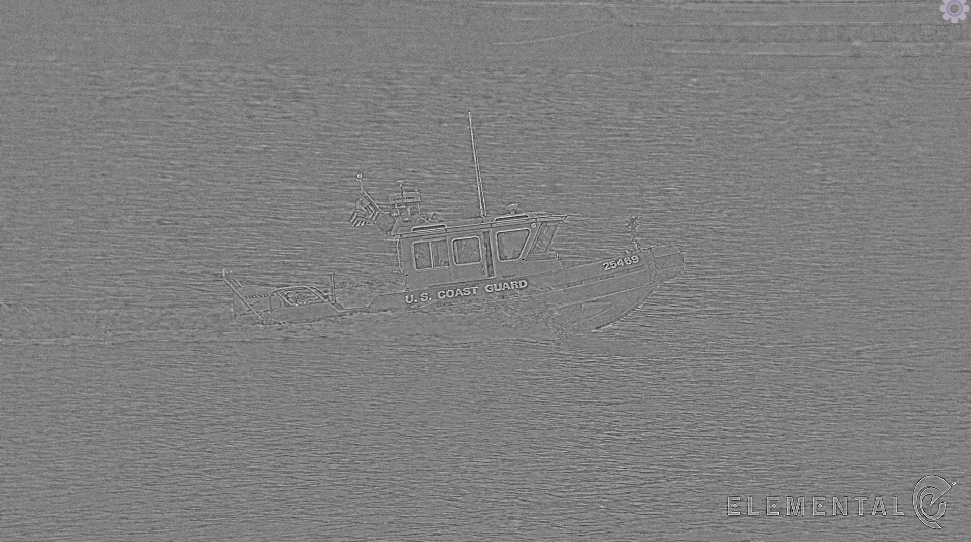
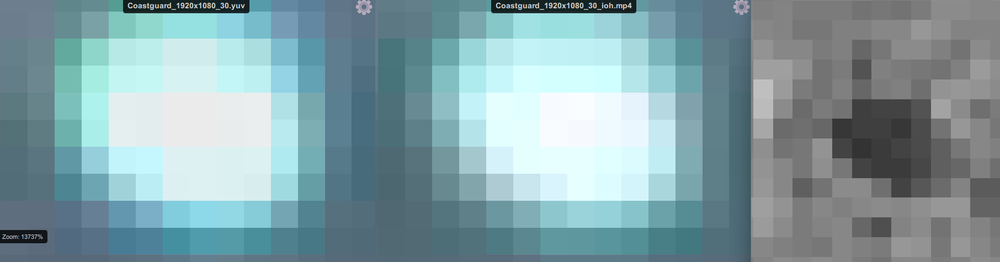
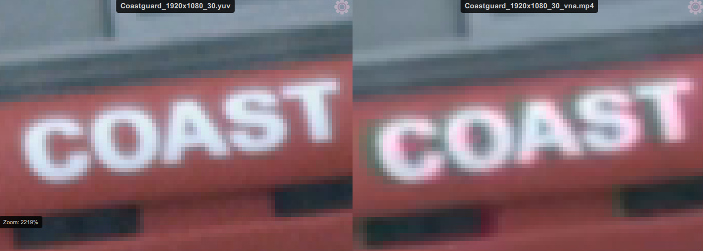
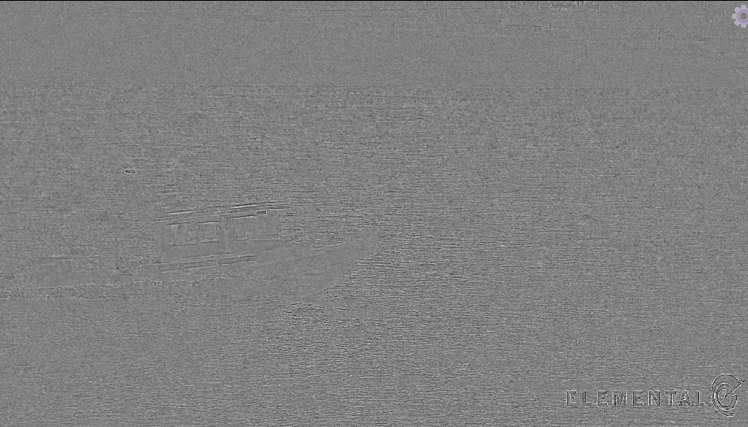
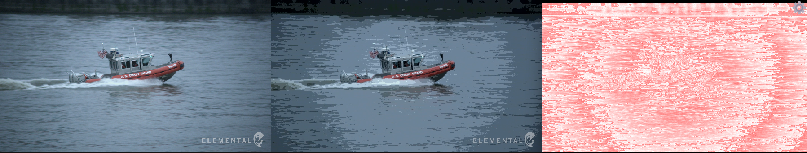
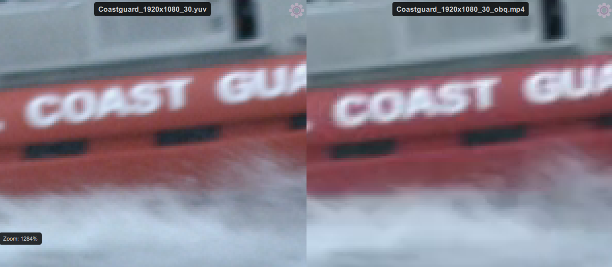

## yuv-corruptor  
[](https://github.com/BoningZ/yuv-corruptor/actions/workflows/build-windows.yml)

[English (Simplified) 🇺🇸](README.en-US.md) | [English (Traditional) 🇬🇧](../../README.md) | [Chinese (Simplified) 🇨🇳](README.zh-CN.md) | [Chinese (Traditional) 🇲🇴](README.zh-Hant.md)

一个命令行小工具：读取原始 YUV 视频，按预设生成多种“肉眼不易察觉”的缺陷 MP4，并输出一份 manifest（“解密”）文件，记录种子、输入信息与各缺陷的参数/位置。

### 会生成哪些缺陷
- bitrate_blocky：低码率 + 快预设编码产生的块状伪影（更贴近真实解码失真）
- brightness_drift：整体 Y 亮度轻微偏移
- jitter_1px：周期性 1 像素轻抖（水平/垂直）
- edge_oversmooth：轻高斯模糊，强调边缘变软
- highlight_clip：高光阈值以上裁剪到 255
- chroma_bleed：局部帧段的色度错位 + 轻模糊
- luma_bleed：局部帧段的亮度拖影/扩散（gblur+blend）
- grain：轻度胶片颗粒（时域噪声）+ 轻锐化
- ringing：轻度过锐/振铃（unsharp+deblock）
- banding：降低 Y 级别（近似 posterize）后轻模糊
- ghosting：轻度时域平均（tblend 低不透明度）
- colorspace_mismatch：解码/编码阶段使用不同色彩空间（bt709 与 bt601）
- repeat_frames_keep_count：在位置 p 重复 r 次，并等量从后续丢弃，保持总帧数一致

输出的文件会在输入基名后追加随机 3 字母后缀，例如 `input_abc.mp4`（种子可控）。

## 缺陷详解与示例

以下说明基于本目录下`CoastGuard_1920x1080_30.yuv`生成，种子为`1755512385570399000`。截图取自一款开源好用的视觉检查工具：[YUViz](https://github.com/LokiW-03/YUViz)

### bitrate_blocky（低码率块状）
采用低码率 + 快速预设进行编码，平坦区域、运动区域容易出现明显宏块边界/马赛克。下图右侧为低码率编码的结果。



### jitter_1px（1 像素抖动）
周期性 1px 水平/垂直环绕移位。对比参考帧与抖动帧，细竖线/横线边缘会出现位置跳动。下图中Diff模式下以下两种模式会周期性交替显示，呈闪烁状。

 

### edge_oversmooth（边缘过平滑）
轻度高斯模糊使边缘与纹理变软，细节略有涂抹感。
Diff模式下物体边缘会格外突出。例如下图中快艇和logo边缘都被突出显示。



### highlight_clip（高光裁剪）
超过阈值的高光被裁为纯白，高亮区域的高光细节丢失。下图从左到右依次是：原视频、高光裁剪后视频、Y-Diff模式。特点是Y-Diff图像会在超过阈值时突变。



### chroma_bleed（色度“溢出/错位”）
色度通道发生轻微错位，边缘处出现彩色边/拖影；常见为 Cb/Cr 的水平/垂直微位移。下图右侧为色彩溢出的结果，色彩向左侧偏移。



### grain（胶片颗粒）
加入细微噪声，平坦区域出现轻度随机纹理。下图右侧为胶片颗粒施加的结果。


### ringing（振铃/光晕）
过锐与轻去块配合，强对比边缘附近出现光晕/二次纹理。
Diff模式下主要体现为静态物体边缘格外突出，例如图中右下角的logo。



### banding（色带）
降低亮度级别（近似色阶化）后更易出现条带状过渡，渐变区域尤为明显。



### ghosting（拖影）
时域混合造成运动目标后方出现淡淡尾迹。
Diff模式下体现为运动物体边缘格外明显，而静态物体边缘不明显。例如下图Diff中海水和快艇的边缘较明显，但是logo和原视频相差不大。


### colorspace_mismatch（色彩空间不匹配）
以一种色彩空间（如 BT.709）解码却以另一种（如 BT.601）标记/转换输出，画面出现轻微色偏（肤色、红橙等尤为明显）。下图中右侧即为色彩故意偏移的结果。




### 依赖
- C++17 编译器（GCC/Clang/MSVC）
- CMake ≥ 3.20（推荐 Ninja）
- ffmpeg / ffprobe 在 PATH 中（或用 `--ffmpeg`/`--ffprobe` 指定）

Windows 推荐：MSYS2 MinGW64 + Ninja

### 构建
Windows（MSYS2 MinGW64 + Ninja）:
```bash
cmake -S . -B build -G Ninja -DCMAKE_BUILD_TYPE=Release
cmake --build build --config Release -j 8
```

Linux/macOS:
```bash
cmake -S . -B build -DCMAKE_BUILD_TYPE=Release
cmake --build build -j
```

生成的可执行文件在 `build/yuv-corruptor[.exe]`。

### 使用
程序会打印帮助：
```
Usage:
  yuv-corruptor <input.yuv> -r WxH [-f fps] [-p pixfmt] [-s seed]
                  [-t types] [-o outdir] [--ffmpeg ffmpeg] [--ffprobe ffprobe]

Flags:
  -r WxH                分辨率，如 -r 176x144（若未提供，将尝试从文件名如 *_352x288_30_*.yuv 推断 WxH 与 fps）
  -f fps                帧率（默认 30；若未提供且文件名包含 _<fps>_ 将尝试从文件名推断）
  -p pixfmt             像素格式（默认 yuv420p）
  -s seed               随机种子（uint64，默认基于时间）
  -t types              逗号分隔：{blocky,brightness,jitter,smooth,highclip,chroma,luma,grain,ringing,banding,ghosting,colorspace,repeat,all}
  -o outdir             输出目录（默认 out_<timestamp>）
  --ffmpeg <path>       ffmpeg 可执行文件路径（默认：使用 PATH 中的 ffmpeg）
  --ffprobe <path>      ffprobe 可执行文件路径（默认：使用 PATH 中的 ffprobe）
```

注意：输入按 `-f rawvideo` 解析；manifest 的帧数估算默认假设 `yuv420p 8-bit`。

### 示例
生成全部缺陷（默认种子与输出目录）：
```bash
build/yuv-corruptor.exe input_1920x1080.yuv -r 1920x1080 -f 30 -p yuv420p
```

只生成重复帧和 chroma-bleed，固定种子，自定义输出目录：
```bash
build/yuv-corruptor.exe input.yuv -r 1280x720 -f 25 -s 123456 -t repeat,chroma -o out_test
```

### 输出
- 多个带 `{base}_{abc}.mp4` 的视频文件（`abc` 为随机 3 字母后缀）
- 输出目录下 `manifest.txt` 示例如下：
```
seed=123456
input=D:/data/input.yuv
size=1920x1080 pix=yuv420p fps=30
total_frames~=300 (assume yuv420p 8-bit)
outputs:
  - input_abc.mp4 | bitrate_blocky | b=500k preset=veryfast
  - input_def.mp4 | luma_bleed | frames=[42..47],[120..123] sigma=0.62 opacity=0.31
```

### 故障排查
- H.264 报“height/width not divisible by 2”：本项目已在所有滤镜末尾追加 `scale=trunc(iw/2)*2:trunc(ih/2)*2`。
- repeat 无法播放/时间戳异常：使用 concat demuxer（`ffconcat version 1.0`）、逐帧 `duration`、末尾补最后一帧，并在编码端 `-fflags +genpts`，像素格式强制 `yuv420p`。
- ffmpeg 不在 PATH：用 `--ffmpeg`/`--ffprobe` 指定完整路径。

### 路线图（更多“肉眼难察觉”预设）
- tmix 轻度时域模糊；微小 hue/saturation/gamma 偏移（短帧段）
- chroma-only 轻柔化、弱 deblock、轻对比度“呼吸”
- 边缘掩码 + 轻蚊噪（更拟真，复杂度更高）

### 许可证
本项目采用 MIT 许可，详见 `LICENSE`。


